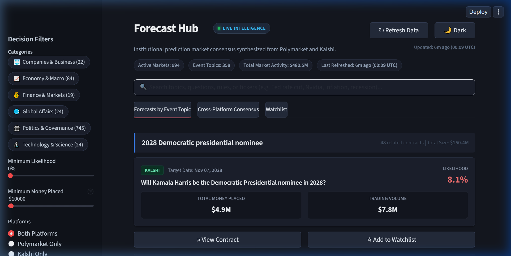
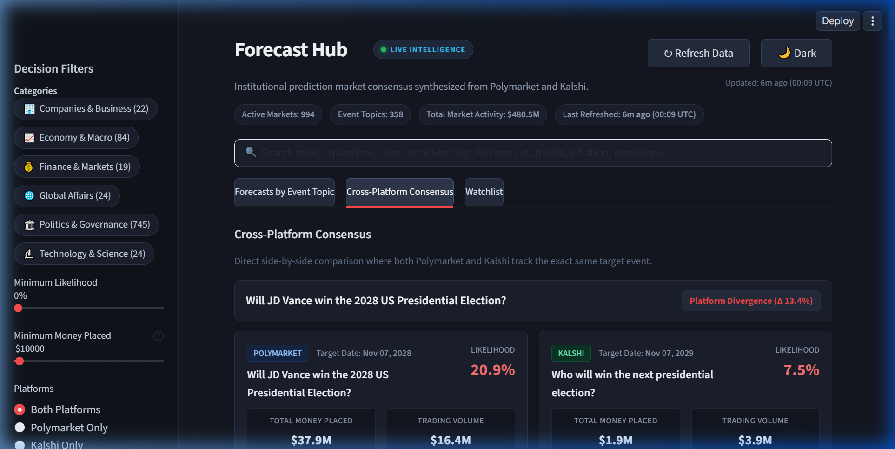
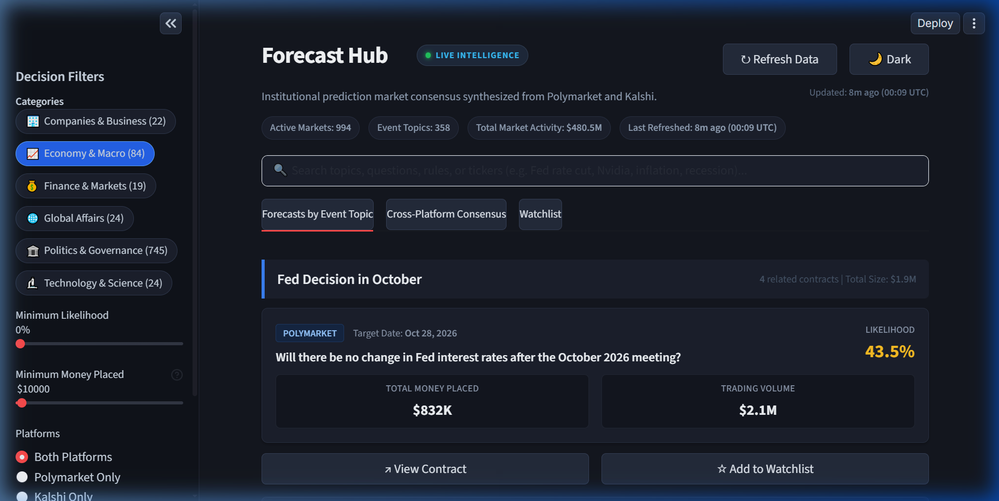
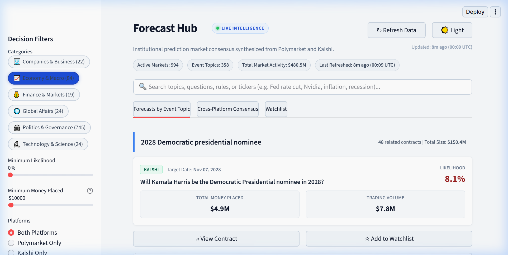

# Forecast Hub

**Forward-looking market consensus for people who have to make actual business decisions.**

Most strategic planning relies on think-tank PDFs, consultant pitch decks, or whatever opinion happened to trend on Twitter this morning. 

Forecast Hub takes a different approach: **skin in the game**. 

We aggregate live forecast data from **Polymarket** (global crypto-settled) and **Kalshi** (CFTC-regulated US exchange), strip out the speculative noise, group contracts by real-world event topics, and present where the money actually sits. When people have their own capital on the line, the signal gets clearer in a hurry.

---

## What It Looks Like

### 1. Forecasts by Event Topic (Parent Umbrella)
Instead of drowning in hundreds of fragmented contracts, related strikes are clustered under unified real-world events.



---

### 2. Cross-Platform Consensus (Where Markets Agree vs. Diverge)
When Polymarket and Kalshi track the exact same target, we align them side-by-side. If both platforms say 70%, that is high-conviction consensus. If one says 60% and the other says 30%, someone is wrong—and that divergence flags real operational risk.



---

### 3. Interactive Decision Filters (Day & Night Modes)
Filter in real time by corporate risk category, topic keyword, minimum likelihood, or capital commitment. Built with seamless high-contrast styling for both Day and Night operation.

#### Night Mode (Active Sector Filter & Watchlist):


#### Day Mode:


---

## How The Engine Works

The system is deliberately lean. No microservices circus, no vector database bloat, no unneeded background daemons. Just concurrent HTTP/2 streams, deterministic grouping logic, and a fast local SQLite database.

```
       [ Polymarket Gamma API ]             [ Kalshi Trade API v2 ]
       (Public Reads / HTTP/2)              (Public Reads / HTTP/2)
                 │                                     │
                 ▼                                     ▼
        Noise & Speculation Filter            Schema Normalizer
       (Drops meme-coin price bets)          (Fixed-point & dollar parser)
                 │                                     │
                 └──────────────────┬──────────────────┘
                                    │
                                    ▼
                         [ Two-Tier Matcher ]
                    ┌───────────────────────────────┐
                    │ Tier 1: Event Topic Cluster   │
                    │ Tier 2: Parameter Guardrail   │
                    │   (Prevents 2% vs 3% clashes) │
                    └───────────────┬───────────────┘
                                    │
                                    ▼
                       [ SQLite Storage (WAL) ]
                    (Instant upsert, zero locks)
                                    │
                                    ▼
                         [ Streamlit UI (Web) ]
                      Instant-launch, plain English
```

### Key Engineering Decisions

* **HTTP/2 Connection Multiplexing:** Both Kalshi and Polymarket endpoints negotiate HTTP/2 natively. We reuse persistent connection pools to fetch hundreds of markets in parallel without socket thrashing.
* **Aggressive Noise Filtering:** 90% of crypto prediction markets are pure retail gambling ("Will Bitcoin reach $150k by Friday?"). Unless your company is an offshore hedge fund, you do not care. We filter out raw token price bets while preserving regulatory, policy, and legislative decisions.
* **Canonical 6-Sector Taxonomy:** Exchange-specific tags and fragmented categories are mapped at the database layer into 6 standardized corporate groups (*Economy & Macro*, *Finance & Markets*, *Politics & Governance*, *Companies & Business*, *Technology & Science*, *Global Affairs*).
* **6-Hour Background Sync & In-Memory Caching:** Instant sub-100ms UI interaction powered by `@st.cache_data`. When data exceeds 6 hours, an asynchronous background thread silently updates consensus with zero screen freezing, dimming, or UI lockup.
* **Two-Tier Matching (Not Raw String Similarity):** 
  * Simple character similarity fails on prediction contracts. A "2% GDP increase" and a "3% GDP increase" look 95% identical to naive string matchers, but they are completely different targets.
  * Our matcher clusters related contracts under parent **Event Topics**, while using strict **parameter guardrails** to ensure only identical strike targets are compared side-by-side.
* **Instant Startup UX:** The application opens in your browser immediately without freezing. If the database is cold, it gives you a clean progress indicator.
* **Plain English:** No finance-bro jargon or crypto abbreviations. We use words normal executives understand: **Likelihood**, **Total Money Placed**, **Platform Difference**, and **Target Date**.

---

## Quickstart

### Prerequisites
* Python 3.10+
* Git

### Installation & Run

**macOS / Linux / Windows (PowerShell):**
```bash
git clone https://github.com/Abraham-Babs/forecast_hub.git
cd forecast_hub
uv sync
uv run main.py
```

Done. Dashboard opens at `http://localhost:8501`.
1. **Clone the repository:**
   ```bash
   git clone https://github.com/Abraham-Babs/Forecast_Hub.git
   cd Forecast_Hub
   ```

2. **Set up a virtual environment and install dependencies:**
   ```bash
   python -m venv .venv
   
   # Windows:
   .\.venv\Scripts\activate

   # macOS / Linux:
   source .venv/bin/activate

   pip install -e .
   ```

3. **Launch:**
   ```bash
   python main.py
   ```

The dashboard opens in your browser at `http://localhost:8501`.

---

## Configuration & Thresholds

Tweak settings in `fetchers/config.py` if your risk appetite or domain focus changes:

* `KALSHI_MIN_OPEN_INTEREST`: Set to `$10,000` (filters out zero-liquidity ghost markets while capturing active events).
* `POLYMARKET_OI_MIN`: Set to `$100,000` (captures high-conviction global markets).
* `KALSHI_CATEGORIES` & `POLYMARKET_CATEGORIES`: Toggle enterprise categories (Economics, Politics, Science & Technology, World).

---

## Project Structure

```
Forecast_Hub/
├── main.py                 # Clean entry point; launches web UI immediately
├── dashboard.py            # Streamlit frontend; topic hierarchy & comparisons
├── pipeline.py             # Ingestion orchestration & two-tier grouping
├── db_manager.py           # SQLite manager with automated schema migrations
├── db_utils.py             # Database retry & lock safety
├── tz_utils.py             # UTC timestamp helpers
├── fetchers/
│   ├── config.py           # Thresholds, categories, and endpoint hosts
│   ├── kalshi_api.py       # Modernized Kalshi v2 parser
│   └── polymarket_api.py   # Polymarket Gamma fetcher & noise filter
├── assets/                 # UI screenshots and documentation media
└── pyproject.toml          # Locked dependencies with HTTP/2 support
```

---

## A Note on Reality

Prediction markets are powerful aggregators of information, but they are not infallible crystal balls. Low-liquidity markets can be pushed around, and unexpected black-swan events happen. 

Use Forecast Hub as a high-signal input for your scenario planning and risk models—not as an excuse to turn your brain off.
